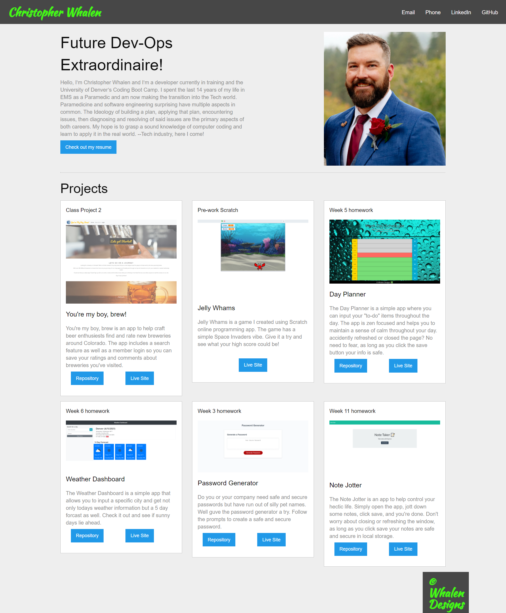

# Updated Portfolio

## Contributers
* Chris Whalen, Github: **[CobaltFrostfish](https://github.com/CobaltFrostfish)**

## Links
* **[Repository](https://github.com/CobaltFrostfish/updated-portfolio)**
* **[Live site](https://cobaltfrostfish.github.io/updated-portfolio/)**

## The project
Having a solid portfolio as a developer is akin to having a good RBI as a pro baseball player. Hence, why this project is a vital task to not only create but to grow and maintain along the way.  I feel mostly confident in the skills I learned and have utilized so far and I know that my skills can grow tremendously the more I practice. This is a good example of my skills thus far. Please take some time to explore this updated version of my portfolio.

## Technologies applied
* HTML
* CSS
* JavaScript
* Foundation

## The final production:
